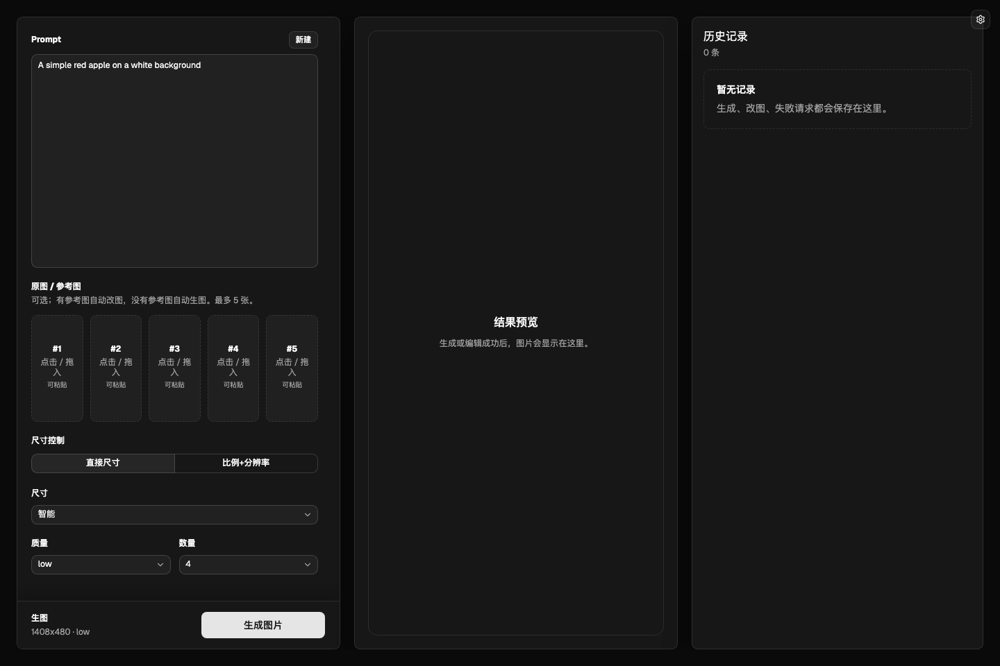

# Image2 Generation App

一个面向 `gpt-image-2` / OpenAI 兼容图片接口的本地 Web 应用。支持无参考图生图、有参考图自动改图、历史记录、图片预览、再次编辑、复制、下载和导入。



## Features

- 自动路由：有参考图时走图片编辑接口，没有参考图时走图片生成接口。
- 多图参考：最多 5 张参考图，支持点击选择、拖拽上传、粘贴上传和拖动换位。
- 参数控制：支持智能尺寸、直接尺寸、宽高比 + 分辨率、质量和数量。
- 历史记录：保存成功、失败、取消和生成中的任务，支持查看、再次编辑、取消、删除和滚动加载。
- 图片查看器：支持鼠标拖动查看，支持 `A/D` 和左右方向键切换。
- 模型设置：右上角可填写 Base URL 和 Key，并验证是否支持 `gpt-image-2`。
- 暗色界面：基于 shadcn/ui + Tailwind 的默认 dark 风格。

## Requirements

- Node.js 20.19+ 或 22.12+
- npm

## Install

```bash
npm install
```

## Run

```bash
npm run dev
```

默认地址：

- Frontend: `http://localhost:5173`
- API server: `http://localhost:8787`

开发模式下，Vite 会把 `/api` 请求代理到后端服务。

如果本机 `8787` 已被其他项目占用，可以指定端口运行：

```bash
PORT=18787 npm run dev:server
```

另开一个终端：

```bash
VITE_API_PROXY_TARGET=http://localhost:18787 npm run dev:client -- --host 0.0.0.0 --port 5173
```

## API Settings

推荐在页面右上角「模型设置」中配置：

1. 填写 OpenAI 兼容接口的 `Base URL`，例如 `https://your-provider.example.com/v1`
2. 填写 API Key
3. 点击「验证」，应用会请求 `${BASE_URL}/models` 并确认存在 `gpt-image-2`
4. 点击「保存」

保存后的配置写入 `.data/settings.json`。该文件可能包含 API Key，已被 `.gitignore` 忽略，不要提交到 GitHub。

也可以使用环境变量作为 fallback：

```bash
IMAGE_API_BASE_URL=https://your-provider.example.com/v1
IMAGE_API_KEY=sk-your-key-here
IMAGE_API_TIMEOUT_MS=3600000
PORT=8787
```

兼容别名：

```text
LLM_API_BASE_URL / LLM_API_KEY
OPENAI_BASE_URL / OPENAI_API_BASE_URL / OPENAI_API_KEY
DEER_API_BASE_URL / DEER_API_KEY / DEER_API_TIMEOUT_MS
```

## Usage

1. 输入 Prompt。
2. 可选上传参考图；有参考图时自动改图，无参考图时自动生图。
3. 选择尺寸控制、质量和数量。
4. 点击「生成图片」，或在 Prompt 输入框中按 Enter 发送。
5. 在右侧历史记录中查看任务，或点击「再次编辑」把参数带回输入区。

## Parameters

尺寸控制：

- 智能：生图默认 `9:16`；改图时按最靠前参考图的比例或原始尺寸推导。
- 直接尺寸：直接选择预设尺寸。
- 比例 + 分辨率：选择宽高比和 `1K` / `2K` / `4K`。

其他参数：

- 质量：`low` / `medium` / `high` / `auto`
- 数量：`1` 到 `4`

注意：应用会把宽高比和分辨率转换成实际发送给 API 的 `size`。

## Scripts

```bash
npm run dev
npm run build
npm run preview
```

测试脚本：

```bash
npm run test:payload-routing
npm run test:history-pagination
npm run test:persistent-history
npm run test:rate-limit
```

`npm run test:params` 和 `npm run test:generate` 会向当前配置的真实图片接口发请求，运行前请确认端口和 API 配置，避免误消耗额度。

## Local Data And Security

不要提交或公开以下文件和目录：

```text
.data/
.env
.env.*
node_modules/
dist/
pet-runs/
.playwright-cli/
```

其中：

- `.data/settings.json` 保存模型 Base URL / Key 和本地参数设置。
- `.data/history.json` 保存历史记录元数据。
- `.data/history-assets/` 保存历史生成图和参考图。
- `.env.local` 可能保存私有 API Key。

这些路径已在 `.gitignore` 中忽略。上传 GitHub 前仍建议执行一次：

```bash
git status --short --ignored
```

确认敏感文件只出现在 `!!` ignored 列表中。
